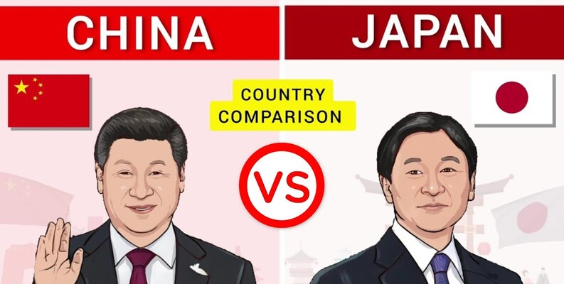

# ✨🚀𝑱𝒂𝒑𝒂𝒏 𝒗𝒔 𝑪𝒉𝒊𝒏𝒂 𝑻𝒆𝒄𝒉 𝑨𝒅𝒗𝒂𝒏𝒄𝒆𝒎𝒆𝒏𝒕𝒔 𝑨𝒏𝒂𝒍𝒚𝒔𝒊𝒔🌐⭐

This project provides a comprehensive analysis of technological advancements in Japan and China using SQL.



## 📊 **Dataset Overview**
The dataset includes detailed information on the tech sectors of China and Japan across different years from 2000 to 2023 containing 1000 rows and columns such as:
- `country` `year` `tech_sector` `market_share` `rd_investment` `number_of_patents` `number_of_tech_companies` `tech_exports_usd` `number_startups` `venture_capital_funding_usd` `global_innovation_rank` `internet_penetration` `five_g_network_coverage` `univ_research_collab` `top_tech_products_exported` `number_of_tech_workers`

## 🔍 **Key Findings**


## 💻 **Technologies Used**


- **SQL** for analysis

## 🛠️ **SQL Features Utilized**

This project makes extensive use of advanced SQL techniques, including:

- **Stored Procedures**: 
  - Created a procedure to calculate the total number of startups in a specified country.
  
  Example:
  ```sql
  DELIMITER //
  CREATE PROCEDURE GetTotalStartupsInCountry(IN input_country VARCHAR(50))
  BEGIN
      SELECT SUM(number_startups) AS total_number_startups
      FROM techAdvancements
      WHERE country = input_country;
  END //
  DELIMITER ;
  CALL GetTotalStartupsInCountry('China');
  ```
  
- **Window Functions**:
  - Used ROW_NUMBER() to find the top tech sector with the highest market share.
  - Used DENSE_RANK() to rank tech sectors based on global innovation rankings.
    
  Example:
  ```sql
  SELECT country, year_, tech_sector, global_innovation_rank, 
       DENSE_RANK() OVER(PARTITION BY country, year_ ORDER BY global_innovation_rank ASC) AS sector_rank
  FROM techAdvancements
  WHERE year_ BETWEEN 2019 and 2023
  ORDER BY year_, sector_rank;
  ```
- **Aggregate Functions**:
  - SUM(), AVG(), and ROUND() were frequently used to analyze investments, market shares, patents, and workforce numbers.
- **Common Table Expressions (CTEs)**:
  - Utilized CTEs for clarity in multi-step calculations, such as determining the growth of startups and R&D investment trends.
- **Joins**:
  - Used JOIN to combine tables for complex calculations and analysis.
- **Ordering and Grouping**:
  - Used GROUP BY for aggregations, and ORDER BY to organize results for better readability.
    
Example:
  ```sql
  WITH startups_growth_cte AS (
    SELECT t.country, 
           MAX(CASE WHEN t.year_ = s.min_year THEN number_startups END) AS start_year_startups,
           MAX(CASE WHEN t.year_ = s.max_year THEN number_startups END) AS end_year_startups
    FROM techAdvancements t
    JOIN startups_years s
    ON t.country = s.country
    GROUP BY t.country
)
SELECT country, (end_year_startups - start_year_startups) AS startup_growth
FROM startups_growth_cte
ORDER BY startup_growth DESC;
  ```
